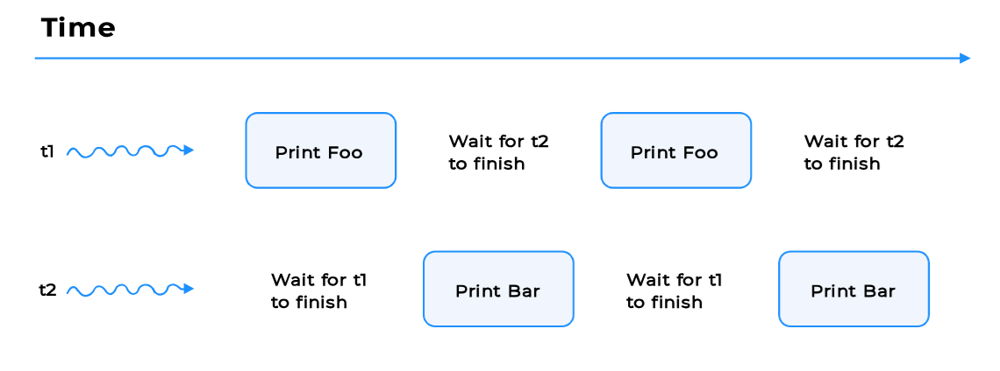

### Printing Foo Bar n Times

Suppose there are two threads t1 and t2. t1 prints Foo and t2 prints Bar. You are required to write a program which takes a user input n. Then the two threads print Foo and Bar alternately n number of times.