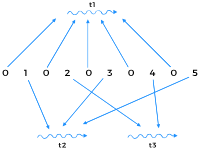

# Printing Number Series (Zero, Even, Odd)

### Problem Statement
Suppose we are given a number n based on which a program creates the series 010203...0n. There are three threads t1, t2 and t3 which print a specific type of number from the series. t1 only prints zeros, t2 prints odd numbers and t3 prints even numbers from the series. The code for the class is given as follows
