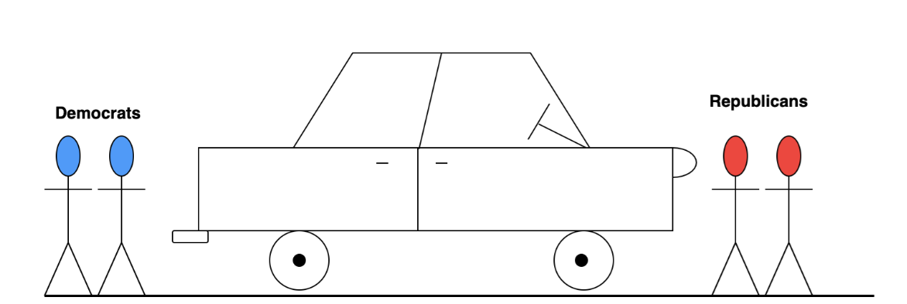

### Uber Ride Problem

Imagine at the end of a political conference, republicans and democrats are trying to leave the venue and ordering Uber rides at the same time. However, to make sure no fight breaks out in an Uber ride, the software developers at Uber come up with an algorithm whereby either an Uber ride can have all democrats or republicans or two Democrats and two Republicans. All other combinations can result in a fist-fight.
